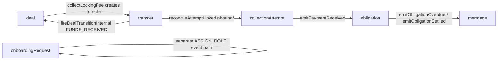

# State Machines Developer Guide

This document is the developer-facing reference for every state machine currently defined in the FairLend codebase, including:

- which files define each machine
- what each machine is responsible for
- states, transitions, guards, and same-state behaviors
- side effects and downstream integrations
- which other state machines or bounded contexts it talks to
- where events enter the machine in production

## Scope

There are two state-machine systems in this repo:

1. The production Governed Transitions engine in [`convex/engine`](../../convex/engine)
2. A demo-only governed-transitions playground in [`convex/demo`](../../convex/demo)

The production registry currently governs six entity types:

| Entity Type | Machine ID | Version | Definition File | Registry |
| --- | --- | --- | --- | --- |
| `onboardingRequest` | `onboardingRequest` | implicit `1.0.0` | [`convex/engine/machines/onboardingRequest.machine.ts`](../../convex/engine/machines/onboardingRequest.machine.ts) | [`convex/engine/machines/registry.ts`](../../convex/engine/machines/registry.ts) |
| `mortgage` | `mortgage` | implicit `1.0.0` | [`convex/engine/machines/mortgage.machine.ts`](../../convex/engine/machines/mortgage.machine.ts) | [`convex/engine/machines/registry.ts`](../../convex/engine/machines/registry.ts) |
| `obligation` | `obligation` | `1.0.0` | [`convex/engine/machines/obligation.machine.ts`](../../convex/engine/machines/obligation.machine.ts) | [`convex/engine/machines/registry.ts`](../../convex/engine/machines/registry.ts) |
| `collectionAttempt` | `collectionAttempt` | `1.2.0` | [`convex/engine/machines/collectionAttempt.machine.ts`](../../convex/engine/machines/collectionAttempt.machine.ts) | [`convex/engine/machines/registry.ts`](../../convex/engine/machines/registry.ts) |
| `deal` | `deal` | `1.0.0` | [`convex/engine/machines/deal.machine.ts`](../../convex/engine/machines/deal.machine.ts) | [`convex/engine/machines/registry.ts`](../../convex/engine/machines/registry.ts) |
| `transfer` | `transfer` | `1.0.0` | [`convex/engine/machines/transfer.machine.ts`](../../convex/engine/machines/transfer.machine.ts) | [`convex/engine/machines/registry.ts`](../../convex/engine/machines/registry.ts) |

There is also one demo-only machine:

| Entity Type | Machine ID | Definition File | Registry | Runtime |
| --- | --- | --- | --- | --- |
| `loanApplication` | `loanApplication` | [`convex/demo/machines/loanApplication.machine.ts`](../../convex/demo/machines/loanApplication.machine.ts) | [`convex/demo/machines/registry.ts`](../../convex/demo/machines/registry.ts) | [`convex/demo/governedTransitions.ts`](../../convex/demo/governedTransitions.ts) |

## Production Engine

### Core files

| Concern | File |
| --- | --- |
| Engine execution | [`convex/engine/transition.ts`](../../convex/engine/transition.ts) |
| Internal mutation wrapper | [`convex/engine/transitionMutation.ts`](../../convex/engine/transitionMutation.ts) |
| Typed public/internal command entrypoints | [`convex/engine/commands.ts`](../../convex/engine/commands.ts) |
| Machine registry | [`convex/engine/machines/registry.ts`](../../convex/engine/machines/registry.ts) |
| Effect registry | [`convex/engine/effects/registry.ts`](../../convex/engine/effects/registry.ts) |
| Audit journal append | [`convex/engine/auditJournal.ts`](../../convex/engine/auditJournal.ts) |
| Serialization of nested state values | [`convex/engine/serialization.ts`](../../convex/engine/serialization.ts) |
| Shared command/result types | [`convex/engine/types.ts`](../../convex/engine/types.ts) |

### Runtime contract

Every governed transition follows the same pattern in [`convex/engine/transition.ts`](../../convex/engine/transition.ts):

1. Resolve the machine from the registry.
2. Load the entity record from its table.
3. Hydrate an XState snapshot from persisted `status` and `machineContext`.
4. Compute the next snapshot with pure `xstate.transition(...)`.
5. Detect whether the event caused:
   - a real state change
   - a same-state transition with effect actions
   - a rejection
6. Persist the entity patch and journal entry atomically.
7. Write layer-3 audit log metadata.
8. Schedule effect handlers from the effect registry.

### Global rules

- No governed entity should have its `status` patched directly outside the transition engine.
- Rejected events are journaled, not ignored.
- Same-state events with effects are treated as successful and auditable.
- XState built-in actions such as `assign` are not scheduled as external effects.
- Transfer critical effects run inline inside the mutation; most other effects are scheduled with `ctx.scheduler.runAfter(0, ...)`.
- Finality is structural. Once a machine reaches a terminal state, only explicitly modeled transitions can move it again.

### Command channels

Command sources are typed in [`convex/engine/types.ts`](../../convex/engine/types.ts). The currently used channels are:

- `admin_dashboard`
- `broker_portal`
- `onboarding_portal`
- `api_webhook`
- `scheduler`
- `simulation`
- `principal_return`

### Cross-machine topology

## Machine: `onboardingRequest`

### Purpose

Controls the manual review and role-provisioning lifecycle for onboarding requests. It is the boundary between a user asking for a role and the system assigning that role in WorkOS.

### Definition and related files

| Concern | File |
| --- | --- |
| Machine definition | [`convex/engine/machines/onboardingRequest.machine.ts`](../../convex/engine/machines/onboardingRequest.machine.ts) |
| Public mutations | [`convex/onboarding/mutations.ts`](../../convex/onboarding/mutations.ts) |
| Effect handlers | [`convex/engine/effects/onboarding.ts`](../../convex/engine/effects/onboarding.ts) |
| Internal onboarding helpers | [`convex/onboarding/internal.ts`](../../convex/onboarding/internal.ts) |

### States

- `pending_review`
- `approved`
- `rejected` (final)
- `role_assigned` (final)

### Transitions

| From | Event | To | Actions |
| --- | --- | --- | --- |
| `pending_review` | `APPROVE` | `approved` | `notifyApplicantApproved` |
| `pending_review` | `REJECT` | `rejected` | `notifyApplicantRejected` |
| `approved` | `ASSIGN_ROLE` | `role_assigned` | `assignRole` |

### Rules and guards

- There are no explicit guards.
- `notifyAdminNewRequest` is modeled as an `entry` action on `pending_review`, but the production GT engine currently only schedules transition actions, not entry/exit actions.
- Because of that limitation, new-request admin notification is fired explicitly from the creation flow, not by the machine engine itself.

### Event entrypoints

| Event | Entry file |
| --- | --- |
| `CREATED` journal seed | [`convex/onboarding/mutations.ts`](../../convex/onboarding/mutations.ts) `requestRole` |
| `APPROVE` | [`convex/onboarding/mutations.ts`](../../convex/onboarding/mutations.ts) `approveRequest` or [`convex/engine/commands.ts`](../../convex/engine/commands.ts) `transitionOnboardingRequest` |
| `REJECT` | [`convex/onboarding/mutations.ts`](../../convex/onboarding/mutations.ts) `rejectRequest` or [`convex/engine/commands.ts`](../../convex/engine/commands.ts) `transitionOnboardingRequest` |
| `ASSIGN_ROLE` | No dedicated production command wrapper currently exists. The event appears in tests and is also referenced from [`convex/engine/effects/onboarding.ts`](../../convex/engine/effects/onboarding.ts). |

### Side effects

| Action | Handler | Behavior |
| --- | --- | --- |
| `notifyApplicantApproved` | [`convex/engine/effects/onboarding.ts`](../../convex/engine/effects/onboarding.ts) | Stub only; logs intent |
| `notifyApplicantRejected` | same file | Stub only; logs intent |
| `notifyAdminNewRequest` | same file | Stub only; logs intent; currently triggered outside the engine |
| `assignRole` | same file | Intended provisioning action for role assignment; calls WorkOS APIs and writes audit metadata. Read the implementation before changing it because the current event wiring is non-trivial. |

### Integrations

- WorkOS organization provisioning and memberships
- onboarding internal helper mutations for processing locks and target-org patching
- audit log

### Other state machines it talks to

- None cross-entity
- It models role assignment as a separate event path on the same machine

### Important notes

- Failure during `assignRole` does not move the request to a failure state. The request stays in `approved` and Convex retries the action.
- `approved` is intentionally an intermediate state, not a final state.
- The current production code has no standalone top-level mutation that dispatches the initial `ASSIGN_ROLE` event. The effect file comments describe an intended post-approval provisioning flow, but the event wiring should be reviewed carefully before relying on it operationally.

## Machine: `mortgage`

### Purpose

Represents the servicing health of a mortgage. It does not own collections, cash postings, or obligation settlement math directly. It reacts to obligation lifecycle signals and exposes the high-level mortgage delinquency/default lifecycle.

### Definition and related files

| Concern | File |
| --- | --- |
| Machine definition | [`convex/engine/machines/mortgage.machine.ts`](../../convex/engine/machines/mortgage.machine.ts) |
| Public transition command | [`convex/engine/commands.ts`](../../convex/engine/commands.ts) `transitionMortgage` |
| Internal transition command | [`convex/engine/commands.ts`](../../convex/engine/commands.ts) `transitionMortgageInternal` |
| Upstream cross-machine effect | [`convex/engine/effects/obligation.ts`](../../convex/engine/effects/obligation.ts) |

### States

- `active`
- `delinquent`
- `defaulted`
- `collections`
- `written_off` (final)
- `matured` (final)

### Context

Defined in [`convex/engine/machines/mortgage.machine.ts`](../../convex/engine/machines/mortgage.machine.ts):

- `lastPaymentAt`
- `missedPayments`

### Guards

| Guard | Meaning |
| --- | --- |
| `allOverduePaid` | Treat the next `PAYMENT_CONFIRMED` as curing the mortgage when `missedPayments <= 1` before the decrement runs |
| `gracePeriodExpired` | Allow `DEFAULT_THRESHOLD_REACHED` only when `missedPayments >= 3` |

### Transitions

| From | Event | To | Actions |
| --- | --- | --- | --- |
| `active` | `OBLIGATION_OVERDUE` | `delinquent` | `incrementMissedPayments` |
| `active` | `PAYMENT_CONFIRMED` | `active` | `recordPayment` |
| `active` | `MATURED` | `matured` | none |
| `delinquent` | `PAYMENT_CONFIRMED` | `active` | `recordPayment` when `allOverduePaid` passes |
| `delinquent` | `PAYMENT_CONFIRMED` | `delinquent` | `recordPayment` otherwise |
| `delinquent` | `OBLIGATION_OVERDUE` | `delinquent` | `incrementMissedPayments` |
| `delinquent` | `DEFAULT_THRESHOLD_REACHED` | `defaulted` | none when `gracePeriodExpired` passes |
| `defaulted` | `COLLECTIONS_INITIATED` | `collections` | none |
| `collections` | `WRITE_OFF_APPROVED` | `written_off` | none |

### Same-state behavior

- `PAYMENT_CONFIRMED` in `active` is a same-state transition with an XState `assign` action, so the engine treats it as successful and persists context changes.
- `PAYMENT_CONFIRMED` in `delinquent` can either cure the mortgage or stay in `delinquent` while still mutating context.

### Event entrypoints

| Event family | Entry file |
| --- | --- |
| User/admin initiated mortgage transitions | [`convex/engine/commands.ts`](../../convex/engine/commands.ts) |
| Cross-entity `OBLIGATION_OVERDUE` / `PAYMENT_CONFIRMED` | [`convex/engine/effects/obligation.ts`](../../convex/engine/effects/obligation.ts) |

### Side effects

- None are scheduled from the mortgage machine itself.
- All actions are in-machine `assign(...)` actions that mutate context only.

### Integrations

- obligation machine via cross-entity effects
- broker/admin mutation permissions via `transitionMortgage`

### Other state machines it talks to

- Receives events from `obligation`
- Does not directly emit events to any other governed machine

### Important notes

- The mortgage machine is intentionally downstream of obligations. Collection-plan code, transfer code, and ledger code should not patch mortgage status directly.

## Machine: `obligation`

### Purpose

Owns the lifecycle of payment obligations from accrual to due, overdue, settlement, or waiver. It is the canonical boundary between money being owed and money being recognized as settled.

### Definition and related files

| Concern | File |
| --- | --- |
| Machine definition | [`convex/engine/machines/obligation.machine.ts`](../../convex/engine/machines/obligation.machine.ts) |
| Internal scheduled transitions | [`convex/payments/obligations/crons.ts`](../../convex/payments/obligations/crons.ts) |
| Public/internal commands | [`convex/engine/commands.ts`](../../convex/engine/commands.ts) |
| Settlement and mortgage bridge effects | [`convex/engine/effects/obligation.ts`](../../convex/engine/effects/obligation.ts) |
| Payment patch + cash receipt | [`convex/engine/effects/obligationPayment.ts`](../../convex/engine/effects/obligationPayment.ts) |
| Accrual cash-ledger posting | [`convex/engine/effects/obligationAccrual.ts`](../../convex/engine/effects/obligationAccrual.ts) |
| Waiver audit effect | [`convex/engine/effects/obligationWaiver.ts`](../../convex/engine/effects/obligationWaiver.ts) |
| Late-fee compatibility shim | [`convex/engine/effects/obligationLateFee.ts`](../../convex/engine/effects/obligationLateFee.ts) |
| Full-waiver admin flow | [`convex/payments/cashLedger/waiveObligationBalanceHandler.ts`](../../convex/payments/cashLedger/waiveObligationBalanceHandler.ts) |

### States

- `upcoming`
- `due`
- `overdue`
- `partially_settled`
- `settled` (final)
- `waived` (final)

### Context

- `obligationId`
- `paymentsApplied`

The context is currently light. Most financial truth lives on the obligation record plus cash-ledger state.

### Guards

| Guard | Meaning |
| --- | --- |
| `isFullySettled` | On `PAYMENT_APPLIED`, checks whether `currentAmountSettled + amount >= totalAmount` |

### Transitions

| From | Event | To | Actions |
| --- | --- | --- | --- |
| `upcoming` | `BECAME_DUE` | `due` | `accrueObligation` |
| `upcoming` | `OBLIGATION_WAIVED` | `waived` | `recordWaiver` |
| `due` | `GRACE_PERIOD_EXPIRED` | `overdue` | `emitObligationOverdue` |
| `due` | `PAYMENT_APPLIED` | `settled` | `applyPayment`, `emitObligationSettled` when `isFullySettled` passes |
| `due` | `PAYMENT_APPLIED` | `partially_settled` | `applyPayment` otherwise |
| `due` | `OBLIGATION_WAIVED` | `waived` | `recordWaiver` |
| `overdue` | `PAYMENT_APPLIED` | `settled` | `applyPayment`, `emitObligationSettled` when `isFullySettled` passes |
| `overdue` | `PAYMENT_APPLIED` | `partially_settled` | `applyPayment` otherwise |
| `overdue` | `OBLIGATION_WAIVED` | `waived` | `recordWaiver` |
| `partially_settled` | `PAYMENT_APPLIED` | `settled` | `applyPayment`, `emitObligationSettled` when `isFullySettled` passes |
| `partially_settled` | `PAYMENT_APPLIED` | `partially_settled` | `applyPayment` otherwise |
| `partially_settled` | `GRACE_PERIOD_EXPIRED` | `overdue` | `emitObligationOverdue` |
| `partially_settled` | `OBLIGATION_WAIVED` | `waived` | `recordWaiver` |

### Event entrypoints

| Event | Entry file |
| --- | --- |
| `BECAME_DUE`, `GRACE_PERIOD_EXPIRED` | [`convex/payments/obligations/crons.ts`](../../convex/payments/obligations/crons.ts) |
| `PAYMENT_APPLIED` | [`convex/engine/commands.ts`](../../convex/engine/commands.ts) `confirmObligationPayment`; [`convex/engine/effects/collectionAttempt.ts`](../../convex/engine/effects/collectionAttempt.ts) `emitPaymentReceived` |
| `OBLIGATION_WAIVED` | [`convex/payments/cashLedger/waiveObligationBalanceHandler.ts`](../../convex/payments/cashLedger/waiveObligationBalanceHandler.ts) |

### Side effects

| Action | Handler | Behavior |
| --- | --- | --- |
| `accrueObligation` | [`convex/engine/effects/obligationAccrual.ts`](../../convex/engine/effects/obligationAccrual.ts) | Posts `OBLIGATION_ACCRUED` to cash ledger |
| `applyPayment` | [`convex/engine/effects/obligationPayment.ts`](../../convex/engine/effects/obligationPayment.ts) | Patches `amountSettled`, optionally stamps `settledAt`, posts cash receipt |
| `emitObligationOverdue` | [`convex/engine/effects/obligation.ts`](../../convex/engine/effects/obligation.ts) | Fires `OBLIGATION_OVERDUE` at the parent mortgage and schedules collection-rule evaluation |
| `emitObligationSettled` | same file | Fires `PAYMENT_CONFIRMED` at the parent mortgage and schedules dispersal-entry creation |
| `recordWaiver` | [`convex/engine/effects/obligationWaiver.ts`](../../convex/engine/effects/obligationWaiver.ts) | Writes audit-only waiver metadata |

### Integrations

- mortgage machine
- cash ledger
- collection-plan rules engine
- dispersal-entry creation
- waiver posting flow

### Other state machines it talks to

- Sends lifecycle signals to `mortgage`
- Receives settlement signals from `collectionAttempt`

### Important notes

- The obligation machine is the servicing boundary. Collection attempts and transfer requests do not decide mortgage status directly.
- `applyPayment` is both a domain-field patch and a cash-ledger posting, which is why it remains an effect rather than an in-machine `assign`.

## Machine: `collectionAttempt`

### Purpose

Tracks operational execution of a planned collection. It models whether a borrower draw was initiated, acknowledged, settled, failed, retried, permanently failed, cancelled, or later reversed.

### Definition and related files

| Concern | File |
| --- | --- |
| Machine definition | [`convex/engine/machines/collectionAttempt.machine.ts`](../../convex/engine/machines/collectionAttempt.machine.ts) |
| Creation and execution spine | [`convex/payments/collectionPlan/execution.ts`](../../convex/payments/collectionPlan/execution.ts) |
| Effect handlers | [`convex/engine/effects/collectionAttempt.ts`](../../convex/engine/effects/collectionAttempt.ts) |
| Transfer reconciliation bridge | [`convex/payments/transfers/collectionAttemptReconciliation.ts`](../../convex/payments/transfers/collectionAttemptReconciliation.ts) |

### States

- `initiated`
- `pending`
- `failed`
- `retry_scheduled`
- `confirmed`
- `reversed` (final)
- `permanent_fail` (final)
- `cancelled` (final)

### Context

- `attemptId`
- `retryCount`
- `maxRetries`

### Guards

| Guard | Meaning |
| --- | --- |
| `canRetry` | Allows retry scheduling while `retryCount < maxRetries` |

### Transitions

| From | Event | To | Actions |
| --- | --- | --- | --- |
| `initiated` | `DRAW_INITIATED` | `pending` | none |
| `initiated` | `DRAW_FAILED` | `failed` | `incrementRetryCount` |
| `initiated` | `FUNDS_SETTLED` | `confirmed` | `emitPaymentReceived` |
| `initiated` | `ATTEMPT_CANCELLED` | `cancelled` | none |
| `pending` | `FUNDS_SETTLED` | `confirmed` | `emitPaymentReceived` |
| `pending` | `DRAW_FAILED` | `failed` | `incrementRetryCount` |
| `failed` | `RETRY_ELIGIBLE` | `retry_scheduled` | `scheduleRetryEntry` when `canRetry` passes |
| `failed` | `MAX_RETRIES_EXCEEDED` | `permanent_fail` | `emitCollectionFailed`, `notifyAdmin` |
| `retry_scheduled` | `RETRY_INITIATED` | `pending` | none |
| `confirmed` | `FUNDS_SETTLED` | `confirmed` | `recordSettlementObserved` |
| `confirmed` | `PAYMENT_REVERSED` | `reversed` | `emitPaymentReversed` |

### Same-state behavior

- `FUNDS_SETTLED` in `confirmed` is intentionally same-state with an effect so duplicate settlement signals are still journaled.

### Event entrypoints

| Event family | Entry file |
| --- | --- |
| Attempt creation journal and initial record | [`convex/payments/collectionPlan/execution.ts`](../../convex/payments/collectionPlan/execution.ts) |
| `DRAW_INITIATED`, `FUNDS_SETTLED`, `DRAW_FAILED`, retry follow-ups | same file |
| Canonical transfer-owned reconciliation | [`convex/payments/transfers/collectionAttemptReconciliation.ts`](../../convex/payments/transfers/collectionAttemptReconciliation.ts) |
| `PAYMENT_REVERSED` | transfer reconciliation and transfer reversal effect paths |

### Side effects

| Action | Handler | Behavior |
| --- | --- | --- |
| `emitPaymentReceived` | [`convex/engine/effects/collectionAttempt.ts`](../../convex/engine/effects/collectionAttempt.ts) | Patches settlement timestamps, applies money across linked obligations, sends overpayment to `UNAPPLIED_CASH` |
| `recordSettlementObserved` | same file | No-op used only for auditable duplicate-settlement observation |
| `scheduleRetryEntry` | same file | Triggers collection-rule evaluation with `COLLECTION_FAILED` context |
| `emitCollectionFailed` | same file | Triggers collection-rule evaluation with `COLLECTION_FAILED` |
| `notifyAdmin` | same file | Stub logging only |
| `emitPaymentReversed` | same file | Starts a durable reversal cascade workflow or defers if the linked transfer owns the ledger reversal |

### Integrations

- obligation machine
- collection-plan rules engine
- cash ledger integrations
- durable workflow component for reversal cascades
- transfer reconciliation bridge

### Other state machines it talks to

- Sends `PAYMENT_APPLIED` to `obligation`
- Receives status-driving events from `transfer`
- Does not talk directly to `mortgage`; obligation remains the only mortgage bridge

### Important notes

- This machine is execution-only. It does not own borrower debt semantics.
- Transfer-linked inbound settlement is transfer-authoritative for cash posting; the attempt exists for business traceability and retry policy.

## Machine: `deal`

### Purpose

Models the deal-closing lifecycle for a fractional mortgage transfer. It coordinates share reservation, lawyer onboarding, document review, funds receipt, confirmation, and cancellation.

### Definition and related files

| Concern | File |
| --- | --- |
| Machine definition | [`convex/engine/machines/deal.machine.ts`](../../convex/engine/machines/deal.machine.ts) |
| Public transition mutation | [`convex/deals/mutations.ts`](../../convex/deals/mutations.ts) `transitionDeal` |
| Reservation effects | [`convex/engine/effects/dealClosing.ts`](../../convex/engine/effects/dealClosing.ts) |
| Notification/document/locking fee effects | [`convex/engine/effects/dealClosingEffects.ts`](../../convex/engine/effects/dealClosingEffects.ts) |
| Deal access effects | [`convex/engine/effects/dealAccess.ts`](../../convex/engine/effects/dealAccess.ts) |
| Prorate effect | [`convex/engine/effects/dealClosingProrate.ts`](../../convex/engine/effects/dealClosingProrate.ts) |
| Future payment-reroute effect | [`convex/engine/effects/dealClosingPayments.ts`](../../convex/engine/effects/dealClosingPayments.ts) |
| Transfer pipeline entrypoints | [`convex/payments/transfers/mutations.ts`](../../convex/payments/transfers/mutations.ts) |

### State model

This is a sequential compound machine:

- `initiated`
- `lawyerOnboarding.pending`
- `lawyerOnboarding.verified`
- `lawyerOnboarding.complete`
- `documentReview.pending`
- `documentReview.signed`
- `documentReview.complete`
- `fundsTransfer.pending`
- `fundsTransfer.complete`
- `confirmed` (final)
- `failed` (final)

Nested phases progress via `onDone`.

### Transitions

| From | Event | To | Actions |
| --- | --- | --- | --- |
| `initiated` | `DEAL_LOCKED` | `lawyerOnboarding.pending` | `reserveShares`, `notifyAllParties`, `createDocumentPackage`, `collectLockingFee` |
| `initiated` | `DEAL_CANCELLED` | `failed` | `voidReservation`, `notifyCancellation`, `revokeAllDealAccess` |
| `lawyerOnboarding.pending` | `LAWYER_VERIFIED` | `lawyerOnboarding.verified` | `createDealAccess` |
| `lawyerOnboarding.verified` | `REPRESENTATION_CONFIRMED` | `lawyerOnboarding.complete` | none |
| `lawyerOnboarding.*` | `DEAL_CANCELLED` | `failed` | `voidReservation`, `notifyCancellation`, `revokeAllDealAccess` |
| `documentReview.pending` | `LAWYER_APPROVED_DOCUMENTS` | `documentReview.signed` | none |
| `documentReview.signed` | `ALL_PARTIES_SIGNED` | `documentReview.complete` | `archiveSignedDocuments` |
| `documentReview.*` | `DEAL_CANCELLED` | `failed` | `voidReservation`, `notifyCancellation`, `revokeAllDealAccess` |
| `fundsTransfer.pending` | `FUNDS_RECEIVED` | `fundsTransfer.complete` | `confirmFundsReceipt` |
| `fundsTransfer.*` | `DEAL_CANCELLED` | `failed` | `voidReservation`, `notifyCancellation`, `revokeAllDealAccess` |
| `fundsTransfer.onDone` | phase completion | `confirmed` | `commitReservation`, `prorateAccrualBetweenOwners`, `updatePaymentSchedule`, `revokeLawyerAccess` |

### Rules and structural behavior

- Cancellation is modeled separately in each non-terminal top-level state because root-level handlers in XState v5 would still fire from final states.
- `onDone` phase gates are the mechanism that advances the machine between nested phases.
- `status` values are nested serialized values such as `lawyerOnboarding.pending`.

### Event entrypoints

| Event family | Entry file |
| --- | --- |
| Admin-driven deal lifecycle events | [`convex/deals/mutations.ts`](../../convex/deals/mutations.ts) `transitionDeal` |
| `FUNDS_RECEIVED` after seller payout confirmation | [`convex/payments/transfers/mutations.ts`](../../convex/payments/transfers/mutations.ts) `fireDealTransitionInternal` |

### Side effects

| Action | Handler | Behavior |
| --- | --- | --- |
| `reserveShares` | [`convex/engine/effects/dealClosing.ts`](../../convex/engine/effects/dealClosing.ts) | Creates or reuses a ledger reservation and links it to the deal |
| `voidReservation` | same file | Voids pending reservation on cancellation |
| `commitReservation` | same file | Commits the reservation when closing completes |
| `notifyAllParties` | [`convex/engine/effects/dealClosingEffects.ts`](../../convex/engine/effects/dealClosingEffects.ts) | Stub notification |
| `notifyCancellation` | same file | Stub notification |
| `createDocumentPackage` | same file | Stub Documenso integration |
| `archiveSignedDocuments` | same file | Stub archive integration |
| `confirmFundsReceipt` | same file | Stub funds-receipt integration |
| `collectLockingFee` | same file | Creates and initiates an inbound transfer for the locking fee |
| `createDealAccess` | [`convex/engine/effects/dealAccess.ts`](../../convex/engine/effects/dealAccess.ts) | Grants lawyer access |
| `revokeAllDealAccess` | same file | Revokes all access on cancellation |
| `revokeLawyerAccess` | same file | Revokes lawyer-only access on confirmation |
| `prorateAccrualBetweenOwners` | [`convex/engine/effects/dealClosingProrate.ts`](../../convex/engine/effects/dealClosingProrate.ts) | Creates prorate entries for seller and buyer |
| `updatePaymentSchedule` | [`convex/engine/effects/dealClosingPayments.ts`](../../convex/engine/effects/dealClosingPayments.ts) | Creates deal reroute records for future payment dispersals |

### Integrations

- ledger reservations
- transfer domain and provider initiation for locking fees
- deal access control
- document package/archive placeholders
- prorate-entry writes
- payment reroute scheduling

### Other state machines it talks to

- Receives `FUNDS_RECEIVED` from `transfer`
- Indirectly creates locking-fee `transfer` records

### Important notes

- Deal confirmation is intentionally decoupled from transfer cash posting. The seller payout leg confirms first; only then does the pipeline fire `FUNDS_RECEIVED`.
- The machine is a canonical example of compound-state serialization in the GT engine.

## Machine: `transfer`

### Purpose

Owns the lifecycle of money movement requests across providers. It is the authoritative machine for provider initiation, settlement, failure, cancellation, and reversal, and it is the canonical owner of transfer-linked cash-ledger postings.

### Definition and related files

| Concern | File |
| --- | --- |
| Machine definition | [`convex/engine/machines/transfer.machine.ts`](../../convex/engine/machines/transfer.machine.ts) |
| Public transfer mutations/actions | [`convex/payments/transfers/mutations.ts`](../../convex/payments/transfers/mutations.ts) |
| Transfer effect handlers | [`convex/engine/effects/transfer.ts`](../../convex/engine/effects/transfer.ts) |
| Collection-attempt reconciliation | [`convex/payments/transfers/collectionAttemptReconciliation.ts`](../../convex/payments/transfers/collectionAttemptReconciliation.ts) |
| Provider registry | [`convex/payments/transfers/providers/registry.ts`](../../convex/payments/transfers/providers/registry.ts) |
| VoPay webhook entry | [`convex/payments/webhooks/vopay.ts`](../../convex/payments/webhooks/vopay.ts) |
| Rotessa PAD webhook entry | [`convex/payments/webhooks/rotessaPad.ts`](../../convex/payments/webhooks/rotessaPad.ts) |
| Reversal entry | [`convex/payments/webhooks/processReversal.ts`](../../convex/payments/webhooks/processReversal.ts) |

### States

- `initiated`
- `pending`
- `processing`
- `confirmed`
- `failed` (final)
- `cancelled` (final)
- `reversed` (final)

### Context

- `transferId`
- `providerRef`
- `retryCount`

The machine context is minimal; most operational detail lives on the transfer record itself.

### Transitions

| From | Event | To | Actions |
| --- | --- | --- | --- |
| `initiated` | `PROVIDER_INITIATED` | `pending` | `recordTransferProviderRef` |
| `initiated` | `FUNDS_SETTLED` | `confirmed` | `publishTransferConfirmed` |
| `initiated` | `TRANSFER_CANCELLED` | `cancelled` | `publishTransferCancelled` |
| `pending` | `PROVIDER_ACKNOWLEDGED` | `pending` | none |
| `pending` | `PROCESSING_UPDATE` | `processing` | none |
| `pending` | `FUNDS_SETTLED` | `confirmed` | `publishTransferConfirmed` |
| `pending` | `TRANSFER_FAILED` | `failed` | `publishTransferFailed` |
| `processing` | `FUNDS_SETTLED` | `confirmed` | `publishTransferConfirmed` |
| `processing` | `TRANSFER_FAILED` | `failed` | `publishTransferFailed` |
| `confirmed` | `TRANSFER_REVERSED` | `reversed` | `publishTransferReversed` |

### Rules and same-state behavior

- `PROVIDER_ACKNOWLEDGED` currently targets `pending` without actions. In the GT engine this becomes a rejected no-op because the serialized state does not change and no effect is scheduled.
- Cancellation is only valid from `initiated`.
- Manual confirmation is allowed only for `manual` and `manual_review` providers, with stricter rules for outbound transfers.

### Event entrypoints

| Event family | Entry file |
| --- | --- |
| Record creation | [`convex/payments/transfers/mutations.ts`](../../convex/payments/transfers/mutations.ts) `createTransferRequest` / `createTransferRequestInternal` |
| `PROVIDER_INITIATED` / immediate `FUNDS_SETTLED` | same file via `initiateTransfer`, `initiateTransferInternal`, `fireInitiateTransition` |
| `FUNDS_SETTLED`, `TRANSFER_FAILED`, `TRANSFER_REVERSED` from providers | webhooks in [`convex/payments/webhooks`](../../convex/payments/webhooks) |
| `TRANSFER_CANCELLED` | [`convex/payments/transfers/mutations.ts`](../../convex/payments/transfers/mutations.ts) `cancelTransfer` |
| Manual settlement path | same file `confirmManualTransferInternal` and `runManualTransferConfirmation` |
| Reconciliation/healing | transfer reconciliation and webhook reprocessing paths |

### Side effects

| Action | Handler | Behavior |
| --- | --- | --- |
| `recordTransferProviderRef` | [`convex/engine/effects/transfer.ts`](../../convex/engine/effects/transfer.ts) | Patches provider reference and writes a domain-write audit journal entry |
| `publishTransferConfirmed` | same file | Records settlement metadata, posts authoritative cash entry, links cash journal entries, reconciles linked collection attempt, updates dispersal entries, advances pipeline legs |
| `publishTransferFailed` | same file | Records failure metadata, reconciles linked collection attempt, updates dispersal-entry failure status, records pipeline failure metadata |
| `publishTransferCancelled` | same file | Mirrors cancellation to linked collection attempt |
| `publishTransferReversed` | same file | Records reversal metadata, reconciles linked attempt, posts reversal entries or transfer-owned reversal cascade, updates dispersal entries |

### Integrations

- payment provider implementations
- bank-account validation
- webhooks
- cash ledger
- collection-attempt reconciliation
- deal-closing transfer pipeline
- dispersal entries

### Other state machines it talks to

- Sends settlement/failure/cancellation/reversal signals to `collectionAttempt`
- Sends `FUNDS_RECEIVED` to `deal` when seller payout leg confirms

### Important notes

- Transfer is authoritative for transfer-linked cash ledger postings. Collection attempts follow it; they do not own the posting.
- Some transfer effects run inline in the engine mutation because they are considered critical for transfer integrity.
- Reversal handling differs for attempt-linked inbound transfers versus standalone transfers.

## Machine: `loanApplication` (Demo Only)

### Purpose

Provides a sandbox example of the governed-transitions pattern in the demo workspace. It is not part of the production machine registry.

### Definition and related files

| Concern | File |
| --- | --- |
| Machine definition | [`convex/demo/machines/loanApplication.machine.ts`](../../convex/demo/machines/loanApplication.machine.ts) |
| Demo registry | [`convex/demo/machines/registry.ts`](../../convex/demo/machines/registry.ts) |
| Demo executor | [`convex/demo/governedTransitions.ts`](../../convex/demo/governedTransitions.ts) |
| Demo effect handlers | [`convex/demo/governedTransitionsEffects.ts`](../../convex/demo/governedTransitionsEffects.ts) |

### States

- `draft`
- `submitted`
- `under_review`
- `needs_info`
- `approved`
- `rejected`
- `funded`
- `closed` (final)

### Guard

| Guard | Meaning |
| --- | --- |
| `hasCompleteData` | Requires `context.data.applicantName` and `context.data.loanAmount` to be present and valid before `SUBMIT` |

### Transitions

| From | Event | To | Actions |
| --- | --- | --- | --- |
| `draft` | `SUBMIT` | `submitted` | `notifyReviewer` when `hasCompleteData` passes |
| `submitted` | `ASSIGN_REVIEWER` | `under_review` | none |
| `under_review` | `APPROVE` | `approved` | `notifyApplicant` |
| `under_review` | `REJECT` | `rejected` | `notifyApplicant` |
| `under_review` | `REQUEST_INFO` | `needs_info` | `notifyApplicant` |
| `needs_info` | `RESUBMIT` | `under_review` | `notifyReviewer` |
| `approved` | `FUND` | `funded` | `scheduleFunding`, `generateDocuments` |
| `rejected` | `REOPEN` | `draft` | none |
| `funded` | `CLOSE` | `closed` | none |

### Integrations

- Demo audit trail component
- Demo audit log component
- Demo-only effect registry

### Other state machines it talks to

- None

## Operational Summary Matrix

| Machine | Primary Responsibility | Receives From | Sends To | External Systems |
| --- | --- | --- | --- | --- |
| `onboardingRequest` | Role review + provisioning | onboarding mutations, admin commands | separate self-owned `ASSIGN_ROLE` path | WorkOS, audit log |
| `mortgage` | Servicing health | obligation effects, manual commands | none | auth/RBAC wrappers only |
| `obligation` | Debt lifecycle + settlement boundary | cron, collection attempts, admin waiver | mortgage | cash ledger, collection rules, dispersal |
| `collectionAttempt` | Collection execution + retry/reversal | collection-plan execution, transfer reconciliation | obligation | cash ledger, workflow component, rules engine |
| `deal` | Fractional closing lifecycle | admin commands, transfer pipeline | indirectly transfer creation | ledger reservations, access control, reroutes, document placeholders |
| `transfer` | Money movement lifecycle | admin actions, provider initiation, webhooks, reconciliation | collectionAttempt, deal | providers, webhooks, bank validation, cash ledger, dispersal |
| `loanApplication` | Demo lifecycle example | demo playground | none | demo audit components |

## Recommended Reading Order

For a developer tracing production behavior end to end:

1. Read [`convex/engine/transition.ts`](../../convex/engine/transition.ts)
2. Read [`convex/engine/machines/registry.ts`](../../convex/engine/machines/registry.ts)
3. Read the specific machine definition
4. Read the machine's mapped effect handlers in [`convex/engine/effects/registry.ts`](../../convex/engine/effects/registry.ts)
5. Read the event entrypoints listed in the machine section above

For the most integration-heavy flows, start with:

- obligation servicing: `obligation` -> `mortgage`
- borrower collection: `transfer` -> `collectionAttempt` -> `obligation` -> `mortgage`
- fractional closing: `deal` -> `transfer` pipeline -> `deal`
