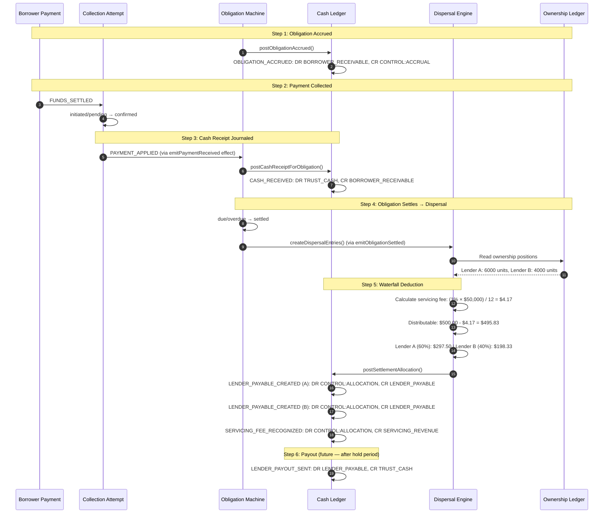
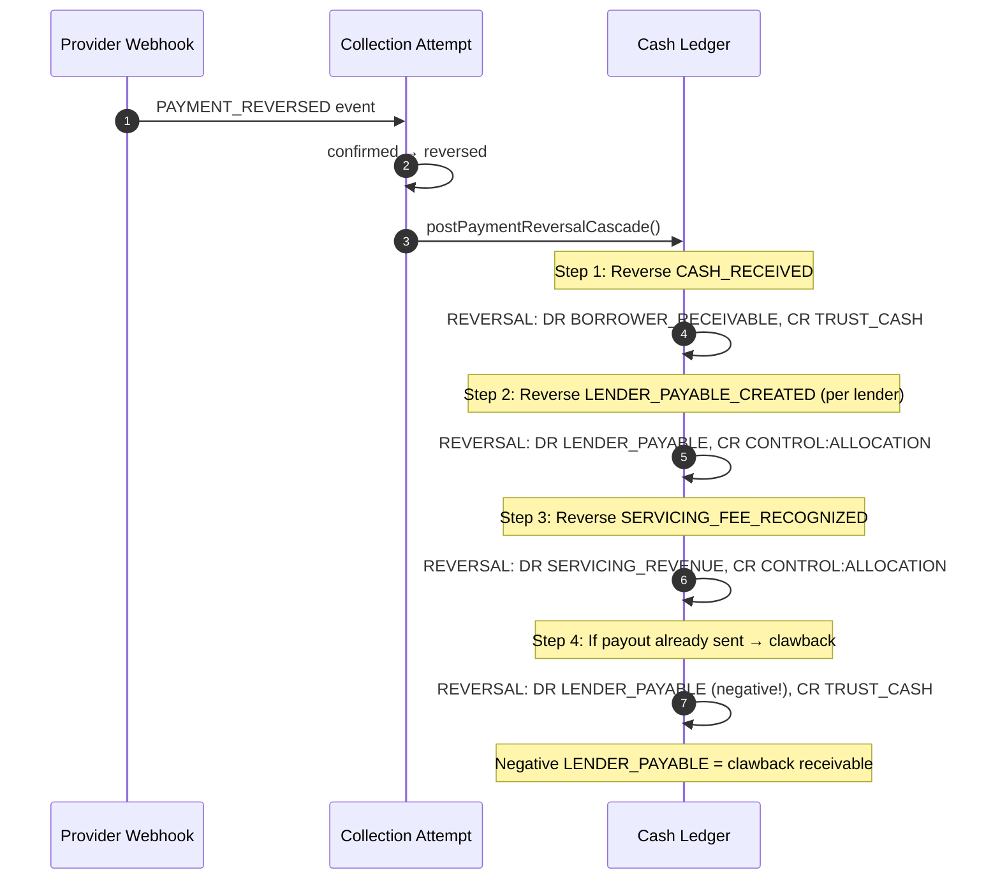

# Cash & Obligations Ledger — Developer Guide

> **Canonical reference for integrating with, querying, and extending the FairLend Cash & Obligations Ledger.**
>
> Last updated: 2026-03-26 | Linear project: Cash & Obligations Ledger (ENG-145–ENG-183)
> Goal spec: [Notion](https://www.notion.so/329fc1b4402480b2b82ffa798d6c8e73)

---

## Table of Contents

1. [Architecture Overview](#1-architecture-overview)
2. [Account Families (Chart of Accounts)](#2-account-families-chart-of-accounts)
3. [Journal Entry Types](#3-journal-entry-types)
4. [Integration Functions (Write API)](#4-integration-functions-write-api)
5. [Query API (Frontend Integration)](#5-query-api-frontend-integration)
6. [Fee System](#6-fee-system)
7. [Settlement Waterfall (End-to-End Flow)](#7-settlement-waterfall-end-to-end-flow)
8. [Reversal & Correction Flows](#8-reversal--correction-flows)
9. [Reconciliation](#9-reconciliation)
10. [Key Invariants](#10-key-invariants)
11. [Idempotency Key Convention](#11-idempotency-key-convention)
12. [RBAC & Auth](#12-rbac--auth)
13. [Testing Patterns](#13-testing-patterns)
14. [Transfer Integration (ENG-184)](#14-transfer-integration-eng-184)

---

## 1. Architecture Overview

### Two-Ledger Architecture

FairLend has two separate ledgers serving different purposes:

| Ledger | Tables | Tracks | Unit | Invariant |
|--------|--------|--------|------|-----------|
| **Ownership Ledger** | `ledger_accounts`, `ledger_journal_entries` | Who owns what fraction of each mortgage | Units (10,000 per mortgage) | `TREASURY + Σ(positions) = 10,000` |
| **Cash Ledger** | `cash_ledger_accounts`, `cash_ledger_journal_entries` | Where every dollar sits and who it's owed to/from | Cents (safe integers) | Balanced double-entry, append-only |

They are joined by shared identifiers (`mortgageId`, `obligationId`, `lenderId`) at the orchestration layer. They never share tables or posting logic.

**Key principle:** Ownership units and trust cash are not the same thing. A lender can own 60% of a mortgage's units while being owed $0 in payables (if no payments have settled yet).

### Three-Layer Payment Architecture

The Cash Ledger sits beneath a three-layer payment system:

```
┌─────────────────────────────────────────────────────────────┐
│ Layer 1: OBLIGATIONS          "What is owed"                │
│   obligations table — governed entity (due → settled)       │
│   Tracks: borrower debts (interest, principal, fees)        │
├─────────────────────────────────────────────────────────────┤
│ Layer 2: COLLECTION PLAN      "How/when to collect"         │
│   collectionPlanEntries — scheduling + method selection     │
│   collectionRules — retry/escalation logic                  │
├─────────────────────────────────────────────────────────────┤
│ Layer 3: COLLECTION ATTEMPTS  "What actually happened"      │
│   collectionAttempts — governed entity (initiated → conf.)  │
│   One attempt = one try to collect money                    │
├─────────────────────────────────────────────────────────────┤
│ CASH & OBLIGATIONS LEDGER     "The money truth"             │
│   cash_ledger_* — append-only balanced double-entry journal │
│   Journals the financial meaning of every confirmed event   │
└─────────────────────────────────────────────────────────────┘
```

### Core Design Principles

- **Append-only**: No journal entry is ever mutated or deleted. Corrections are new entries with `causedBy` linkage.
- **Balanced double-entry**: Every posting debits one account and credits another for the same amount.
- **Idempotent**: Every posting has a deterministic `idempotencyKey`. Duplicate calls return the existing entry.
- **Cents-based**: All amounts are safe integers in cents. No floating-point arithmetic anywhere.
- **Sequenced**: A global monotonic `sequenceNumber` enables deterministic replay and point-in-time reconstruction.

### File Layout

```
convex/payments/cashLedger/
├── accounts.ts           # Account CRUD, balance calculations, cache
├── disbursementGate.ts   # Pre-payout validation (non-negative payable)
├── hashChain.ts          # Audit trail hash chain integration
├── integrations.ts       # Public write API (all posting functions)
├── postEntry.ts          # Core posting pipeline (9-step validated)
├── postingGroups.ts      # Multi-entry posting group helpers
├── queries.ts            # Public read API (frontend-facing)
├── reconciliation.ts     # Balance reconciliation logic
├── reconciliationCron.ts # Cron entry point for daily checks
├── reconciliationQueries.ts  # Gap detection queries
├── reconciliationSuite.ts    # Full reconciliation suite runner
├── replayIntegrity.ts    # Journal replay verification
├── sequenceCounter.ts    # Global monotonic sequence
├── transferReconciliation.ts # Transfer-specific gap detection
├── types.ts              # Type definitions, constants, mappings
├── validators.ts         # Convex validators for posting args
└── __tests__/            # ~20 test suites
```

---

## 2. Account Families (Chart of Accounts)

Every cash ledger account belongs to one of 9 families. Accounts are scoped by dimensions (`mortgageId`, `obligationId`, `lenderId`, `borrowerId`).

### Debit-Normal Families

(Balance increases with debits, decreases with credits)

| Family | Purpose | Scoped By | When Created |
|--------|---------|-----------|--------------|
| `BORROWER_RECEIVABLE` | What a borrower owes FairLend | `mortgageId` + `obligationId` | On obligation accrual |
| `TRUST_CASH` | Cash held in platform trust account | `mortgageId` | On first cash receipt for a mortgage |
| `CASH_CLEARING` | External cash in transit (async providers) | `mortgageId` | On async provider acknowledgment (Phase 2+) |
| `UNAPPLIED_CASH` | Cash not matched to obligations (fees, deposits, overpayments) | `mortgageId` | On overpayment, locking fee, or commitment deposit |
| `WRITE_OFF` | Loss recognition | `mortgageId` | On admin write-off |
| `SUSPENSE` | Exception holding bucket for unresolvable items | `mortgageId` | On suspense escalation |

### Credit-Normal Families

(Balance increases with credits, decreases with debits)

| Family | Purpose | Scoped By | When Created |
|--------|---------|-----------|--------------|
| `LENDER_PAYABLE` | What FairLend owes a lender | `mortgageId` + `lenderId` | On dispersal allocation |
| `SERVICING_REVENUE` | FairLend platform fee revenue | `mortgageId` | On servicing fee recognition |

### CONTROL Family (Subaccounts)

The `CONTROL` family uses named subaccounts to prevent an opaque ever-growing balance:

| Subaccount | Purpose | Expected Net |
|------------|---------|--------------|
| `ACCRUAL` | Contra-receivable for recognized obligations | Zeroed on cash receipt |
| `ALLOCATION` | Intermediate holding during dispersal | Net-zero per posting group |
| `SETTLEMENT` | Bridges cash receipt to obligation settlement | Net-zero after matching |
| `WAIVER` | Expense recognition for waived amounts | Accumulates (expense) |

Subaccounts are stored in the `subaccount` field of `cash_ledger_accounts`.

### Getting Balances

```typescript
import { getCashAccountBalance } from "../payments/cashLedger/accounts";

// Balance = cumulativeDebits - cumulativeCredits (for debit-normal)
// Balance = cumulativeCredits - cumulativeDebits (for credit-normal)
const balance: bigint = getCashAccountBalance(account);
```

---

## 3. Journal Entry Types

All entries are stored in `cash_ledger_journal_entries`. Each entry debits one account and credits another.

| Entry Type | Debit Family | Credit Family | Trigger |
|------------|-------------|---------------|---------|
| `OBLIGATION_ACCRUED` | `BORROWER_RECEIVABLE` | `CONTROL` (ACCRUAL) | Obligation becomes due |
| `CASH_RECEIVED` | `TRUST_CASH` or `CASH_CLEARING` | `BORROWER_RECEIVABLE` or `UNAPPLIED_CASH` | Collection confirmed |
| `CASH_APPLIED` | `UNAPPLIED_CASH` or `CONTROL` | `BORROWER_RECEIVABLE` or `CONTROL` | Unapplied cash matched to obligation |
| `LENDER_PAYABLE_CREATED` | `CONTROL` (ALLOCATION) | `LENDER_PAYABLE` | Dispersal allocates to lender |
| `SERVICING_FEE_RECOGNIZED` | `CONTROL` (ALLOCATION) | `SERVICING_REVENUE` | Servicing fee deducted in waterfall |
| `LENDER_PAYOUT_SENT` | `LENDER_PAYABLE` | `TRUST_CASH` | Funds sent to lender |
| `OBLIGATION_WAIVED` | `CONTROL` (WAIVER) | `BORROWER_RECEIVABLE` | Admin waives obligation |
| `OBLIGATION_WRITTEN_OFF` | `WRITE_OFF` | `BORROWER_RECEIVABLE` | Admin writes off bad debt |
| `REVERSAL` | *Mirror of original credit* | *Mirror of original debit* | Payment reversed (NSF, ACH return) |
| `CORRECTION` | *Depends on error* | *Depends on error* | Admin correction with `causedBy` |
| `SUSPENSE_ESCALATED` | `SUSPENSE` | *Varies* | Unresolvable item parked |
| `SUSPENSE_ROUTED` | *Target family* | `SUSPENSE` | Suspense item resolved |

### Entry Schema

```typescript
// Key fields on every journal entry
{
  sequenceNumber: bigint,          // monotonic replay key
  entryType: CashEntryType,
  debitAccountId: Id<"cash_ledger_accounts">,
  creditAccountId: Id<"cash_ledger_accounts">,
  amount: bigint,                  // safe-integer cents
  idempotencyKey: string,          // deterministic, prevents duplicates
  effectiveDate: string,           // YYYY-MM-DD business date
  timestamp: number,               // Unix ms system time
  postingGroupId?: string,         // groups multi-entry events
  causedBy?: Id<"cash_ledger_journal_entries">,
  source: CommandSource,           // provenance (who, from where)
  // Dimension references
  mortgageId?, obligationId?, attemptId?,
  transferRequestId?, dispersalEntryId?,
  lenderId?, borrowerId?,
}
```

---

## 4. Integration Functions (Write API)

All posting functions live in `convex/payments/cashLedger/integrations.ts`. They are internal functions called by engine effects, not directly by the frontend.

Every function calls `postCashEntryInternal()` — the 9-step validated pipeline that enforces balanced entries, family constraints, idempotency, sequencing, and non-negative balance checks.

### Obligation Lifecycle

#### `postObligationAccrued(ctx, args)`
Creates a `BORROWER_RECEIVABLE` entry when an obligation becomes due.

```typescript
await postObligationAccrued(ctx, {
  obligationId: obligation._id,
  source: { channel: "scheduler", actorType: "system" },
});
// → OBLIGATION_ACCRUED: debit BORROWER_RECEIVABLE, credit CONTROL:ACCRUAL
// Idempotency key: "cash-ledger:obligation-accrued:{obligationId}"
```

### Cash Receipt

#### `postCashReceiptForObligation(ctx, args)`
Journals a confirmed cash receipt against a borrower's receivable.

```typescript
await postCashReceiptForObligation(ctx, {
  obligationId: obligation._id,
  amount: 50000,  // $500.00 in cents
  idempotencyKey: buildIdempotencyKey("cash-received", attemptId),
  attemptId: attempt._id,
  postingGroupId: `cash-receipt:${attemptId}`,
  source: command.source,
});
// → CASH_RECEIVED: debit TRUST_CASH, credit BORROWER_RECEIVABLE
// Returns null if BORROWER_RECEIVABLE account doesn't exist (logs audit error)
```

#### `postCashReceiptWithSuspenseFallback(ctx, args)`
Same as above but routes to `SUSPENSE` if no receivable account exists (instead of returning null).

#### `postOverpaymentToUnappliedCash(ctx, args)`
Routes excess payment amount to `UNAPPLIED_CASH`.

```typescript
await postOverpaymentToUnappliedCash(ctx, {
  attemptId: attempt._id,
  amount: 1500,  // $15.00 overpayment
  mortgageId: mortgage._id,
  postingGroupId: `cash-receipt:${attemptId}`,
  source: command.source,
});
// → CASH_RECEIVED: debit TRUST_CASH, credit UNAPPLIED_CASH
```

### Dispersal Allocation

#### `postSettlementAllocation(ctx, args)`
Multi-entry posting that allocates settled cash to lender payables and servicing revenue.

```typescript
await postSettlementAllocation(ctx, {
  mortgageId: mortgage._id,
  obligationId: obligation._id,
  settledDate: "2026-03-15",
  lenderPayments: [
    { lenderId: lenderA._id, dispersalEntryId: entryA._id, amount: 29750 },
    { lenderId: lenderB._id, dispersalEntryId: entryB._id, amount: 19833 },
  ],
  servicingFee: 417,
  source: command.source,
});
// → LENDER_PAYABLE_CREATED per lender (debit CONTROL:ALLOCATION, credit LENDER_PAYABLE)
// → SERVICING_FEE_RECOGNIZED (debit CONTROL:ALLOCATION, credit SERVICING_REVENUE)
// All entries share postingGroupId: "allocation:{obligationId}"
```

### Payout Execution

#### `postLenderPayout(ctx, args)`
Journals funds sent to a lender. Enforces non-negative payable balance.

```typescript
await postLenderPayout(ctx, {
  mortgageId: mortgage._id,
  lenderId: lender._id,
  dispersalEntryId: entry._id,
  amount: 29750,
  effectiveDate: "2026-03-20",
  source: command.source,
});
// → LENDER_PAYOUT_SENT: debit LENDER_PAYABLE, credit TRUST_CASH
```

### Deal & Fee Events

#### `postDealBuyerFunds(ctx, { dealId, amount, effectiveDate, source })`
Buyer funds received on deal close (Leg 1). Debits `TRUST_CASH`, credits `CASH_CLEARING`.

#### `postDealSellerPayout(ctx, { dealId, lenderId, amount, effectiveDate, source })`
Trust pays seller on deal close (Leg 2). Debits `LENDER_PAYABLE`, credits `TRUST_CASH`.

#### `postLockingFeeReceived(ctx, { feeId, mortgageId, amount, effectiveDate, source })`
Locking fee collected. Debits `TRUST_CASH`, credits `UNAPPLIED_CASH`.

#### `postCommitmentDepositReceived(ctx, { depositId, mortgageId, amount, effectiveDate, source })`
Commitment deposit collected. Debits `TRUST_CASH`, credits `UNAPPLIED_CASH`.

### Waiver & Write-Off

#### `postObligationWaived(ctx, { obligationId, amount, effectiveDate, source, reason })`
Admin waives obligation balance. Debits `CONTROL:WAIVER`, credits `BORROWER_RECEIVABLE`.

#### `postObligationWrittenOff(ctx, { obligationId, amount, effectiveDate, source, reason })`
Admin writes off bad debt. Debits `WRITE_OFF`, credits `BORROWER_RECEIVABLE`.

### Corrections & Reversals

#### `postCashCorrectionForEntry(ctx, { originalEntryId, reason, source, replacement? })`
Admin correction. Creates a reversal of the original + optional replacement entry. Requires `source.actorType === "admin"`.

#### `postPaymentReversalCascade(ctx, { attemptId?, transferRequestId?, obligationId, mortgageId, effectiveDate, source, reason })`
Full reversal of a settlement: CASH_RECEIVED → LENDER_PAYABLE_CREATED → SERVICING_FEE → LENDER_PAYOUT_SENT (clawback). All entries share a `postingGroupId`. Idempotent.

#### `postTransferReversal(ctx, { transferRequestId, originalEntryId, amount, effectiveDate, source, reason })`
Single-entry reversal for transfer-backed payments. Validates `transferRequestId` consistency.

---

## 5. Query API (Frontend Integration)

Public queries use `cashLedgerQuery` from fluent-convex, which requires `payment:view` permission.

### `getAccountBalance({ accountId })`
Returns the current balance of a single cash ledger account.

```typescript
// Frontend usage
import { useSuspenseQuery } from "@tanstack/react-query";
import { convexQuery } from "@convex-dev/react-query";
import { api } from "../../convex/_generated/api";

const { data: balance } = useSuspenseQuery(
  convexQuery(api.payments.cashLedger.queries.getAccountBalance, {
    accountId: accountId,
  })
);
```

### `getObligationBalance({ obligationId })`
Returns the borrower receivable balance for an obligation plus reconciliation data.

```typescript
const { data } = useSuspenseQuery(
  convexQuery(api.payments.cashLedger.queries.getObligationBalance, {
    obligationId,
  })
);
// data.outstandingBalance — bigint, cents owed
// data.journalDerivedBalance — bigint, from journal replay
// data.projectionMatch — boolean, do they agree?
```

### `getMortgageCashState({ mortgageId })`
Returns all cash ledger balances for a mortgage, grouped by account family.

```typescript
const { data } = useSuspenseQuery(
  convexQuery(api.payments.cashLedger.queries.getMortgageCashState, {
    mortgageId,
  })
);
// data.balancesByFamily = {
//   BORROWER_RECEIVABLE: 50000n,  // borrower owes $500
//   TRUST_CASH: 30000n,           // $300 in trust
//   LENDER_PAYABLE: 29583n,       // $295.83 owed to lenders
//   SERVICING_REVENUE: 417n,      // $4.17 in fees
// }
```

### `getLenderPayableBalance({ lenderId })`
Returns what FairLend owes this lender across all mortgages.

```typescript
const { data: payable } = useSuspenseQuery(
  convexQuery(api.payments.cashLedger.queries.getLenderPayableBalance, {
    lenderId,
  })
);
// payable is a bigint in cents
```

### Additional Internal Queries

These are internal (not frontend-facing) and used by reconciliation/effects:

- `getJournalSettledAmountForObligation(ctx, obligationId)` — sum of CASH_RECEIVED for this obligation
- `getControlBalanceBySubaccount(ctx, mortgageId, subaccount)` — CONTROL subaccount balance
- `reconcileObligationSettlementProjectionInternal(ctx, obligationId)` — compare obligation.amountSettled vs journal

---

## 6. Fee System

### Three-Tier Architecture

```
Tier 1: feeTemplates            (platform-wide definitions)
  │     "Standard Servicing Fee" → code: "servicing", rate: 1%
  │     "Standard Late Fee" → code: "late_fee", fixed: $50
  │     "Standard NSF Fee" → code: "nsf", fixed: $50
  │
Tier 2: feeSetTemplates         (bundles of templates)
  │     "Standard Mortgage Fees" → [servicing, late_fee, nsf]
  │     feeSetTemplateItems links templates to sets with sortOrder
  │
Tier 3: mortgageFees            (per-mortgage runtime overrides)
        mortgageId + code + surface + effectiveFrom/To + parameters
        Immutable snapshot: changing the template doesn't affect existing mortgageFees
```

### Fee Codes

| Code | Surface | Calculation Type | Description |
|------|---------|-----------------|-------------|
| `servicing` | `waterfall_deduction` | `annual_rate_principal` | Deducted from settlement before lender splits |
| `late_fee` | `borrower_charge` | `fixed_amount_cents` | New obligation created for borrower |
| `nsf` | `borrower_charge` | `fixed_amount_cents` | Config-ready, auto-generation deferred in v1 |

### Surface Types

- **`waterfall_deduction`**: Deducted from settlement amount BEFORE lender payouts. Lenders receive less. FairLend keeps the fee as `SERVICING_REVENUE`.
- **`borrower_charge`**: Creates a NEW obligation for the borrower. Collected separately via collection plan.

### Calculation Types

- **`annual_rate_principal`**: `fee = (annualRate × principalBalance) / periodsPerYear`
  - `periodsPerYear` is derived from payment frequency: monthly=12, bi_weekly=26, weekly=52
- **`fixed_amount_cents`**: Fixed amount in cents (e.g., 5000 = $50.00)

### Adding a Fee at Runtime

```typescript
import { attachFeeTemplateToMortgageSnapshot } from "../fees/resolver";

// Attach a custom servicing rate to a specific mortgage
await attachFeeTemplateToMortgageSnapshot(ctx.db, {
  mortgageId: mortgage._id,
  feeTemplate: servicingTemplate,
  parameterOverrides: { annualRate: 0.015 }, // Override from 1% to 1.5%
  effectiveFrom: "2026-04-01",
  effectiveTo: "2026-12-31", // Optional end date
});
```

Or attach the default fee set:

```typescript
import { attachDefaultFeeSetToMortgage } from "../fees/resolver";

await attachDefaultFeeSetToMortgage(ctx.db, mortgage._id, 0.0125); // 1.25% override
```

### Fee Resolution Priority

When the dispersal engine calculates servicing fees, `resolveServicingFeeConfig()` resolves in this order:

1. **`mortgageFees`** — query by `mortgageId + code:"servicing" + surface:"waterfall_deduction"` where `effectiveFrom ≤ asOfDate ≤ effectiveTo` and `status = "active"`. If found, use its `parameters.annualRate`.
2. **`mortgage.annualServicingRate`** — fallback field on the mortgage document (legacy default, typically 1%).

### Servicing Fee Calculation

```typescript
// convex/dispersal/servicingFee.ts
export function calculateServicingFee(
  annualRate: number,
  principalBalance: number,  // cents
  paymentFrequency: PaymentFrequency
): number {
  const periodsPerYear = PERIODS_PER_YEAR[paymentFrequency];
  return Math.round((annualRate * principalBalance) / periodsPerYear);
}

// PERIODS_PER_YEAR = { monthly: 12, bi_weekly: 26, accelerated_bi_weekly: 26, weekly: 52 }
```

---

## 7. Settlement Waterfall (End-to-End Flow)



### Async Provider Flow (Phase 2+)

For async providers (VoPay PAD, Rotessa), the flow uses `CASH_CLEARING`:

1. Provider acknowledges → `CASH_RECEIVED`: DR `CASH_CLEARING`, CR `BORROWER_RECEIVABLE`
2. Final settlement confirmed → sweep: DR `TRUST_CASH`, CR `CASH_CLEARING`

---

## 8. Reversal & Correction Flows

### Payment Reversal Cascade

When a payment is reversed (NSF, ACH return — up to 90 days post-settlement):



All reversal entries share a `postingGroupId` and are idempotent. The cascade is executed in a durable workflow for automatic retry.

### Transfer Reversal

For transfer-backed payments (Phase 1+):

```typescript
await postTransferReversal(ctx, {
  transferRequestId: transfer._id,
  originalEntryId: originalCashReceivedEntry._id,
  amount: 50000,
  effectiveDate: "2026-03-25",
  source: { channel: "api_webhook", actorType: "system" },
  reason: "NSF return from VoPay",
});
```

Validates that `originalEntryId` carries the same `transferRequestId`. Creates a single `REVERSAL` entry.

### Admin Correction

```typescript
await postCashCorrectionForEntry(ctx, {
  originalEntryId: wrongEntry._id,
  reason: "Incorrect amount — should have been $500 not $50",
  source: { channel: "admin_dashboard", actorType: "admin", actorId: "user_abc" },
  replacement: {
    amount: 50000,
    debitAccountId: correctDebit._id,
    creditAccountId: correctCredit._id,
    entryType: "CASH_RECEIVED",
  },
});
```

Requires `source.actorType === "admin"`. Creates reversal of original + corrected entry, both linked via `causedBy`.

---

## 9. Reconciliation

### Scheduled Checks

The reconciliation cron runs daily at 07:00 UTC (one hour after obligation transitions at 06:00 UTC).

| Check | What It Detects | Self-Healing |
|-------|----------------|-------------|
| Confirmed transfers without journal entries | `publishTransferConfirmed` effect failed silently | Re-schedule effect → SUSPENSE after 3 failures |
| Reversed transfers without reversal entries | Reversal effect failed | Re-schedule → SUSPENSE |
| Outbound transfers without dispersal update | Payout confirmed but `dispersalEntry.status` still "pending" | Patch dispersal status |
| Amount mismatches | Journal amount ≠ transfer amount | Flag for admin |
| CONTROL non-zero balance per posting group | Incomplete allocation | Flag for admin |
| Settled obligations with non-zero receivable | Reversal indicator | Flag for admin |
| Settled obligations without dispersal entries | `emitObligationSettled` scheduler failure | Self-healing cron (every 15 min) |

### Transfer Reconciliation (every 15 min)

```
convex/crons.ts:
  "transfer reconciliation" → internal.payments.cashLedger.transferReconciliation...
  Runs every 15 minutes — highest-risk gap because publishTransferConfirmed
  runs async via scheduler.runAfter(0) and can fail silently.
```

### Dispersal Self-Healing (every 15 min)

```
convex/crons.ts:
  "dispersal self-healing" → internal.dispersal.selfHealing.dispersalSelfHealingCron
  Detects settled obligations without dispersal entries.
  Uses transferHealingAttempts / dispersalHealingAttempts tables for retry tracking.
```

---

## 10. Key Invariants

| Invariant | Rule | Verified By |
|-----------|------|-------------|
| **Obligation Balance** | `net(BORROWER_RECEIVABLE postings) = outstanding obligation balance` | Reconciliation query |
| **Payable** | `net(LENDER_PAYABLE postings) = unpaid amount owed to lender` | `getLenderPayableBalance()` |
| **Cash Traceability** | Every confirmed collection/payout maps to ≥1 journal entry | Transfer reconciliation cron |
| **Replay Ordering** | Point-in-time reconstruction uses `sequenceNumber` as canonical order | `replayJournalIntegrity()` |
| **Append-Only** | No journal entry is ever mutated or deleted | Schema constraint (no patch/delete on journal) |
| **Non-Negative Payable** | No payout reduces `LENDER_PAYABLE` below zero | `disbursementGate.ts` pre-check |
| **Cents Integrity** | All amounts are safe integers, no floats | `postCashEntryInternal()` validation |
| **CONTROL Net-Zero** | Each CONTROL subaccount nets to zero per completed posting group | Reconciliation query |
| **Reversal Traceability** | Every `REVERSAL` has `causedBy` referencing the original entry | `postTransferReversal()` / `postPaymentReversalCascade()` validation |
| **Transfer-Journal** | Every confirmed transfer has exactly one matching journal entry | Transfer reconciliation cron |

---

## 11. Idempotency Key Convention

Format: `cash-ledger:{entry-type}:{source-type}:{source-id}`

Built via `buildIdempotencyKey()` from `convex/payments/cashLedger/types.ts`:

```typescript
import { buildIdempotencyKey } from "../payments/cashLedger/types";

// Prefix "cash-ledger:" is automatic
buildIdempotencyKey("obligation-accrued", obligationId);
// → "cash-ledger:obligation-accrued:{obligationId}"

buildIdempotencyKey("lender-payable", dispersalEntryId);
// → "cash-ledger:lender-payable:{dispersalEntryId}"
```

### All Key Patterns

| Entry Path | Key Pattern |
|-----------|-------------|
| Obligation accrual | `cash-ledger:obligation-accrued:{obligationId}` |
| Cash receipt (attempt) | `cash-ledger:cash-received:{attemptId}` (caller-provided) |
| Cash receipt (transfer) | `cash-ledger:cash-received:transfer:{transferRequestId}` |
| Overpayment | `cash-ledger:overpayment:{attemptId}` |
| Lender payable | `cash-ledger:lender-payable:{dispersalEntryId}` |
| Servicing fee | `cash-ledger:servicing-fee:{obligationId}` |
| Lender payout | `cash-ledger:lender-payout-sent:transfer:{transferRequestId}` |
| Deal buyer funds | `cash-ledger:deal-buyer-funds:{dealId}` |
| Deal seller payout | `cash-ledger:deal-seller-payout:{dealId}:{lenderId}` |
| Locking fee | `cash-ledger:locking-fee:{mortgageId}:{feeId}` |
| Commitment deposit | `cash-ledger:commitment-deposit:{mortgageId}:{depositId}` |
| Reversal (transfer) | `cash-ledger:reversal:transfer:{transferRequestId}` |
| Reversal (cascade) | `cash-ledger:reversal:cash-received:{identifier}` |

### Transfer-Level Idempotency (separate from cash ledger)

Transfer creation has its own idempotency layer (Decision D3 from ENG-184):
- System-generated: `transfer:{direction}:{transferType}:{referenceId}`
- Admin/manual: Caller-provided

---

## 12. RBAC & Auth

### Query Access

All public queries use `cashLedgerQuery` from `convex/fluent.ts`:

```typescript
export const getAccountBalance = cashLedgerQuery
  .input({ accountId: v.id("cash_ledger_accounts") })
  .handler(async (ctx, args) => { ... })
  .public();
```

`cashLedgerQuery` requires `payment:view` permission via fluent-convex middleware.

### Mutation Access

Integration functions (posting) are `internalMutation` — called by engine effects, not directly by frontend or external APIs. No auth check needed because the caller (Transition Engine) already validated authorization.

### Admin Operations

Corrections and manual adjustments require `source.actorType === "admin"`:

```typescript
function assertAdminCorrectionSource(source: CommandSource) {
  if (source.actorType !== "admin") {
    throw new ConvexError("Cash correction requires admin actorType");
  }
  if (!source.actorId?.trim()) {
    throw new ConvexError("Cash correction requires source.actorId");
  }
}
```

---

## 13. Testing Patterns

### Test Setup

```typescript
import { describe, expect, it } from "vitest";
import { createTestConvex, ensureSeededIdentity } from "../../../src/test/auth/helpers";
import { FAIRLEND_ADMIN } from "../../../src/test/auth/identities";

describe("my cash ledger test", () => {
  it("does something", async () => {
    const t = createTestConvex();
    await ensureSeededIdentity(t, FAIRLEND_ADMIN);

    // Seed test data using t.run() for direct DB access
    const mortgageId = await t.run(async (ctx) => {
      // ... insert mortgage, obligation, accounts ...
    });

    // Call functions via t.mutation() / t.query()
    const result = await t.mutation(internalRef, { ... });
  });
});
```

### Seeding Accounts

```typescript
await t.run(async (ctx) => {
  await ctx.db.insert("cash_ledger_accounts", {
    family: "BORROWER_RECEIVABLE",
    mortgageId,
    obligationId,
    cumulativeDebits: 0n,
    cumulativeCredits: 0n,
    createdAt: Date.now(),
  });
});
```

### Verifying Journal Entries

```typescript
await t.run(async (ctx) => {
  const entries = await ctx.db
    .query("cash_ledger_journal_entries")
    .withIndex("by_obligation_and_sequence", q => q.eq("obligationId", obligationId))
    .collect();

  expect(entries).toHaveLength(1);
  expect(entries[0].entryType).toBe("CASH_RECEIVED");
  expect(Number(entries[0].amount)).toBe(50000);
});
```

### Existing Test Suites (~20 files)

| Suite | Coverage |
|-------|----------|
| `cashReceipt.test.ts` | Cash receipt posting, missing receivable handling |
| `cashReceiptIntegration.test.ts` | Full applyPayment effect → cash receipt flow |
| `cashApplication.test.ts` | CASH_APPLIED from unapplied cash |
| `lenderPayoutPosting.test.ts` | LENDER_PAYOUT_SENT with non-negative enforcement |
| `postingGroups.test.ts` | Multi-entry posting group semantics |
| `reversalCascade.test.ts` | Full reversal cascade with clawback |
| `reversalIntegration.test.ts` | End-to-end reversal via webhook |
| `financialInvariantStress.test.ts` | Stress testing invariants under load |
| `chaosTests.test.ts` | Resilience under failure conditions |
| `reconciliationSuite.test.ts` | Gap detection queries |
| `disbursementGate.test.ts` | Pre-payout validation |
| `auditTrail.test.ts` | T-008 through T-014 audit trail integration |

### Known Test Gaps (ENG-226)

- Fee date-window resolution (does `asOfDate` pick the right config?)
- Fee deactivation fallback behavior
- Concurrent fee attachment race condition
- Parameter override isolation from template changes

---

## 14. Transfer Integration (ENG-184)

### Phase 1: Parallel Paths

ENG-184 introduces the Transfer Domain Foundation. During Phase 1, two parallel paths coexist:

#### Path A: Bridged (collection attempt → transfer audit trail)

```
CollectionAttempt confirms → emitPaymentReceived effect
  → postCashReceiptForObligation() (cash posted HERE)
  → Create transferRequest with collectionAttemptId (audit trail only)
  → publishTransferConfirmed SKIPS cash posting (collectionAttemptId present)
```

#### Path B: Native (transfer-driven, no collection attempt)

```
createTransferRequest() → TransferProvider.initiate()
  → Transfer machine: initiated → confirmed
  → publishTransferConfirmed POSTS cash (no collectionAttemptId)
  → postCashReceiptForTransfer() or postLenderPayoutForTransfer()
```

### The `collectionAttemptId` Discriminator (Decision D4)

```typescript
// In publishTransferConfirmed effect:
if (transfer.collectionAttemptId) {
  // BRIDGED: cash already posted by collection attempt's applyPayment effect
  // Skip cash posting — this transfer is audit trail only
  console.info(`[publishTransferConfirmed] Bridged transfer ${transferId} — skipping cash posting`);
} else {
  // NATIVE: no other posting path — we must post
  if (transfer.direction === "inbound") {
    await postCashReceiptForTransfer(ctx, { transferRequestId, source });
  } else {
    await postLenderPayoutForTransfer(ctx, { transferRequestId, source });
  }
}
```

### New Integration Functions (Phase 1)

#### `postCashReceiptForTransfer(ctx, { transferRequestId, source })`
Loads the transfer, resolves account families by transfer type:
- Obligation-backed inbound: DR `TRUST_CASH`, CR `BORROWER_RECEIVABLE`
- Fee/deposit inbound: DR `TRUST_CASH`, CR `UNAPPLIED_CASH`
- Idempotency key: `cash-ledger:cash-received:transfer:{transferRequestId}`

#### `postLenderPayoutForTransfer(ctx, { transferRequestId, source })`
Journals outbound payout:
- DR `LENDER_PAYABLE`, CR `TRUST_CASH`
- Idempotency key: `cash-ledger:lender-payout-sent:transfer:{transferRequestId}`

### Migration Timeline

| Phase | What Changes | Risk |
|-------|-------------|------|
| **M2a** (ENG-184) | Parallel transfer records created alongside existing flow. Cash still posted by attempt path. | Zero — audit trail only |
| **M2b** (future) | Per-type reroute: transfer drives cash posting. Flip one type at a time after reconciliation. | Low — per-type, reversible |
| **M3** (ENG-185+) | Outbound payouts and deal transfers use transfer path natively from day one. | Low — greenfield |

---

## Appendix: Quick Reference

### How to answer "How much does borrower X owe?"
```typescript
const balance = await getObligationBalance({ obligationId });
// balance.outstandingBalance is the journal-derived receivable
```

### How to answer "How much do we owe lender Y?"
```typescript
const payable = await getLenderPayableBalance({ lenderId });
// payable is a bigint in cents
```

### How to answer "Where is every dollar for mortgage Z?"
```typescript
const state = await getMortgageCashState({ mortgageId });
// state.balancesByFamily shows the complete cash picture
```

### How to add a new fee type
1. Add a new `feeCodeValidator` literal in `convex/fees/validators.ts`
2. Add validation rules in `assertValidFeeDefinition()` in `convex/fees/resolver.ts`
3. Create a fee template via `createFeeTemplate` mutation
4. If it's a `waterfall_deduction`: add calculation logic in `calculateServicingSplit()`
5. If it's a `borrower_charge`: add obligation creation logic in the appropriate effect

### How to add a new cash entry type
1. Add the literal to `CASH_ENTRY_TYPES` in `convex/payments/cashLedger/types.ts`
2. Add family constraints to `CASH_ENTRY_TYPE_FAMILY_MAP`
3. Add the literal to `cashEntryTypeValidator` in `validators.ts`
4. Add the literal to `cash_ledger_journal_entries.entryType` union in `schema.ts`
5. Create an integration function in `integrations.ts` that calls `postCashEntryInternal()`
6. Add reconciliation checks if applicable
